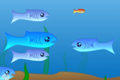

# Hungry Sharks the Game Notes

## MVC Architecture thoughts

### Model

- Is the "map"
- Stores all "characters"
  - each character is an instance of a character class
- Handles interaction between characters
- Handle character motion
  - Update characters' positions and velocities

### View

- Draws the map and characters
- 
- Draws what the player sees

### Controller

- "keyboard controller"
  - takes mouse/keyboard input from the player and controls the their character
- AI controller
  - Responds to the AI character's distance from the player
  - Has a random choice of behavior pattern
    - Small/dumb
    - Small/smart
    - Large/passive
    - Large/aggressive

## Character Class

### Every character has

- Attributes
  - Size
  - Position
  - Kinematics
    - Velocity
    - Maybe Acceleration

### AI character inherits from Character and has

- Attributes
  - Observation radius
  - Behavior pattern

### Player's Character inherits from Character and has

- Attributes
  
## Course of Action

### Pressing issues

- **Player motion using mouse.** we are currently drawing all objects and filling the scree white
- **Eating**
- **Growth**
- **Respawns**

We now have a baby-game

### The goal

- **fix the frame rate stuff**
- **AI movement/response**
  - **Make it impossible to go out of bounds**
  - **The player will have to corner the small, fast fish**
- **bigger you are, the more you require to grow**
  - **improve this**
- **Win/lose screen**
  - **(win/ lose detection)**
- **spawn predators further away**
- **boost**
  - this should take up health when you have it activated
  - cannot boost if health = 0

we now have a kids game

### Extra

- **Graphics**
  - **Color by size**
  - **Drawing images**

- Obstacles
- AI behavior diversity
- **Increasing difficulty**
- Different player models

we now have a sick game

## Bugs

- Wall spanking
- Enemies spawn too close
- Fish sizes
